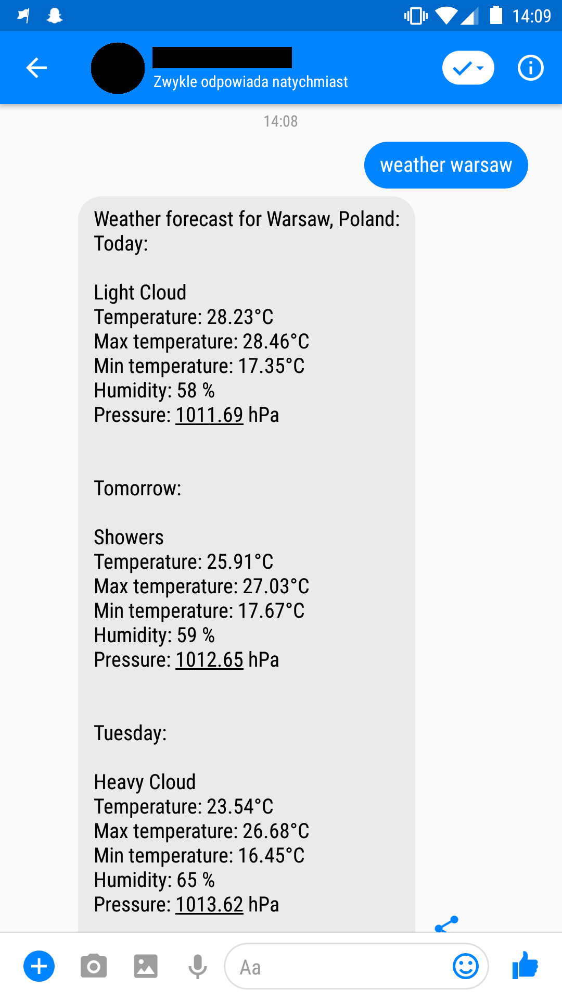

# fb-weather-bot
   

Fb-weather-bot is a very simple weather bot for Facebook Messenger. Weather data is fetched from great public <a href="https://www.metaweather.com/api/">MetaWeather</a> API.

# used technologies

  - Java 8
  - Groovy
  - Gradle
  - Spring Boot 2
  - <a href="https://github.com/messenger4j/messenger4j">Messenger4j</a>
  - Lombok
  - Spock
  - Mockito 2 (for mocking final java classes)
  - Jacoco
  - Travis CI
  - Heroku
  - Sonarcloud
  
  # documentation
  
  <a href="https://szotaa.github.io/fb-weather-bot/">Javadocs</a>
  
  # example
  
  Bot response for `weather warsaw` message:
  
  
